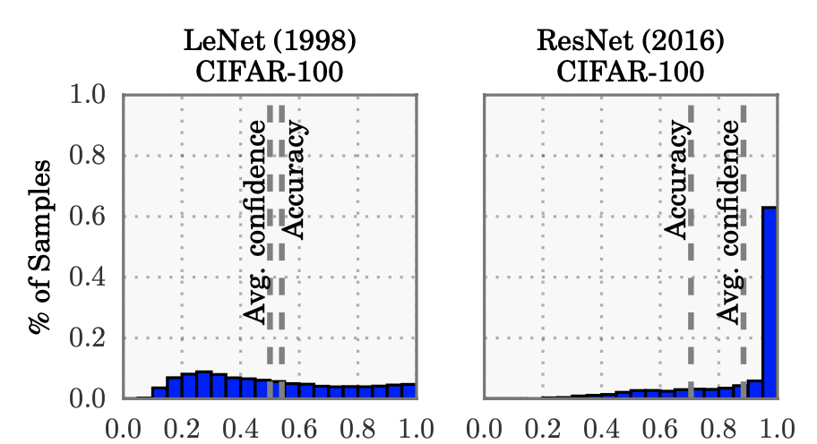
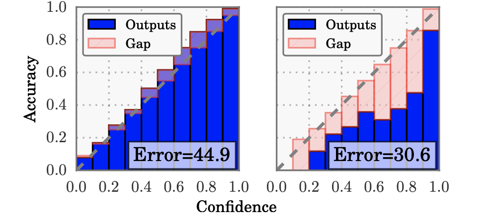
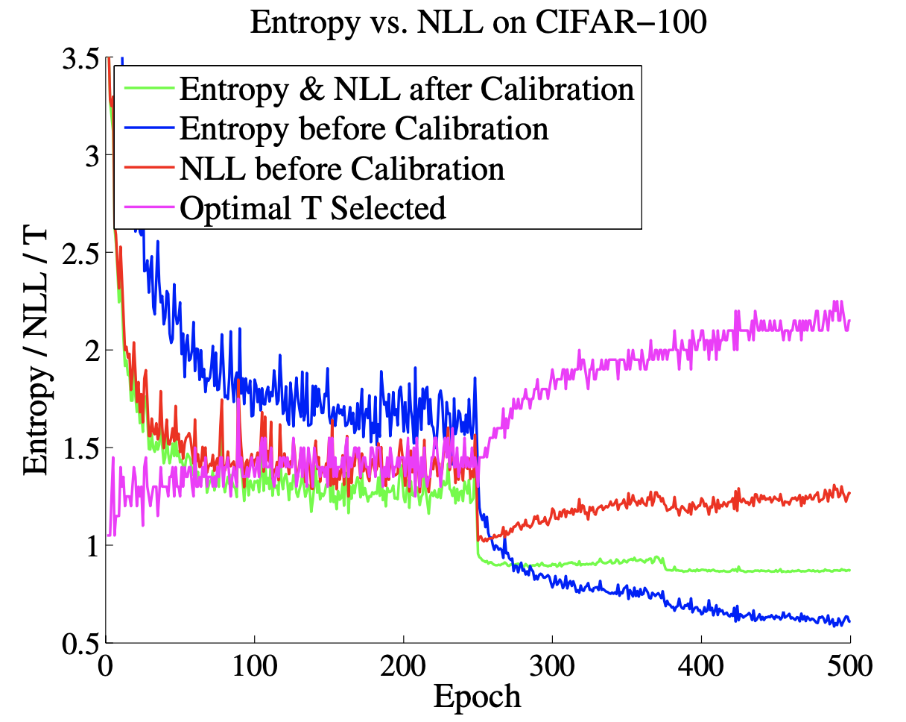

While working on deep learning projects, I observed that confidence scores of deep learning models (for classification tasks) were extremely high while the model performed well on metrics like validation accuracy, AUROC, etc. I realized that this was a problem because the confidence score of the model on any out-of-distribution data was over 90%. This was a problem of miscalibration, and this post will be an attempt to summarise the paper, [On Calibration of Modern Neural Networks](https://arxiv.org/abs/1706.04599) which tries to understand the topic of calibration in detail.

### Introduction to Calibration

Calibration refers to probability estimates of a deep neural network being representative of the true correctness likelihood. For example, given 100 predictions each with a confidence estimate of 0.8, 80 of them should be correctly classified. Therefore, for a perfectly calibrated model, the average accuracy should match the average confidence estimate 

While modern neural networks have become more accurate, they are mostly poorly calibrated. The Figure from the paper compares a 5-layer LeNet <d-cite key="lecun1998gradient"></d-cite> with a 110 layer ResNet <d-cite key="he2016deep"></d-cite> on CIFAR-100 dataset. Based on the definition of calibration, it is essential that average accuracy of a model matches the average confidence in the best case situation. While LeNet has the average confidence close to the accuracy, the average confidence of a ResNet is much higher than the accuracy. 

<figure>

<figcaption align="center">Figure 1. Confidence Histograms for a 5-layer LeNet (left) and a 110-layer ResNet (right) on CIFAR-100. </figcaption>
</figure>

**Why is Miscalibration an Issue?** An uncalibrated model cannot distinguish between in-distribution and out-of-distribution samples. For example, DNNs trained to classify MNIST images often produce high confident probability 91% even for random noise (see the work of ([Hendrycks & Gimpel, 2016](https://arxiv.org/abs/1610.02136))).

### Methods To Quantify and Visualize Calibration

The following methods are used to visualize and quantify calibration.

1. Reliability diagrams
2. Expected Calibration Error (ECE)
3. Maximum Calibration Error (MCE)

##### Reliability Diagrams : Visual Representation of Model Calibration

<figure>

<figcaption align="center">Figure 2. Reliability diagrams (bottom) for a 5-layer LeNet (left) and a 110-layer ResNet (right) on CIFAR-100. </figcaption>
</figure>

A reliability diagram plots the expected accuracy as a function of confidence. For a finite set of samples, the confidences can be grouped into $$M$$ bins (each of size $$1/M$$), and the average accuracy for each group can be calculated accordingly. Let $$B_m$$ be the set of indices whose predictions falls in the interval $$I_m = (\frac{m-1}{M}, \frac{m}{M})$$, the expected accuracy for that interval would be,

\begin{equation}
acc(B_m) = \frac{1}{|B_m|}\sum_{i \epsilon B_m}1(\hat{y_i} = y_i)
\end{equation}

For examples, if we have take all the predictions between 0.3 and 0.4, we calculate the accuracy for this bin as the number of correct predictions (based on a threshold) divided by the number of samples in this bin. For a perfectly calibrated model, the expected accuracy for each bin would be equal to the average confidence value of that bin, thereby plotting an identity function. Any deviation from the identity function would represent miscalibration.   

##### Expected Calibration Error (ECE)

If we take an average of all the gaps (defined by the difference in average accuracy and confidence for a bin) that are present in the reliability diagram (look at the right plot in figure 2.), we get the expected calibration error. From a mathematical perspective, Expected Calibration Error is a scalar summary statistic of calibration and it follows,

\begin{equation}
E_{\hat{p}}[|P(\hat{Y} = Y | \hat{P} = p) - p|]
\end{equation}

An emperical form of $$(2)$$ can be approximated by partitioning predicted confidences into M equally spaced bins (similar to reliability diagrams) and taking a weighted average of the bins’ accuracy/confidence difference.

\begin{equation}
ECE = \sum_{i=m}^{M}\frac{|B_m|}{n}|acc(B_m) - conf(B_m)|
\end{equation}

##### Maximum Calibration Error (MCE)

The highest gap in the reliability diagram is the Maximum Calibration Error. This is a useful measure for high risk applications where reliable probability estimates are needed. It is the maximum deviation between bin accuracy and confidence. The exact mathematical form ($$4$$), 

\begin{equation}
\max_{p \epsilon [0, 1]}|P(\hat{Y} = Y | \hat{P} = p) - p|
\end{equation}

An emperical form of $$(4)$$ can be approximated similarly to $$(3)$$, 

\begin{equation}
ECE = \max_{m\epsilon{\{1,...,M\}}}|acc(B_m) - conf(B_m)|
\end{equation}

**Note:** We can visualize both MCE and ECE on reliability diagrams. MCE is the largest calibration gap (red bars) across all bins, whereas ECE is a weighted average of all gaps. For perfectly calibrated classifiers, MCE and ECE both equal 0.

### Temperature Scaling
The main contribution of this paper is the technique, Temperature Scaling which is a post training approach to calibrate predictions of a model. We’ll go through some concepts before discussing the exact method, making it easier to digest temperature scaling.

**Softmax Function with Temperature:** The softmax function ($$\sigma_{SM}$$)  usually used as an activation function to go from logits to probabilistic outputs. For instance, for a classification problem involving more than $$K > 2$$ Classes, the network produces an output logit $$z_i$$, class prediction $$\hat{y_i}$$ and confidence score $$\hat{p_i}$$ for each input $$x_i$$. The network logits $$z_i$$ are vectors, where $$\hat{y_i} = argmax_k \space z_i^{k}$$, and $$\hat{p_i}$$ is derived using the softmax function $$\sigma_{SM}$$. (The temperature term $$T$$ is usually set to 1).

\begin{equation}
\sigma_{SM}(z_i)^{(k)}  = \frac{\exp(z_i^{(k)}/ T)}{\sum_{j=1}^{K}\exp(z_i^{(j)}/ T)}
\end{equation}

Varying the temperature term can make the softmax outputs smoother (higher $$T$$) or peaky (lower $$T$$). If $$T \rightarrow \infty $$, the softmax function becomes a uniform distribution with the output being $$1/K$$, whereas if $$T \rightarrow 0 $$, the output becomes a point mass.

**Intuition of the method proposed (Temperature Scaling):** The intuition of the method proposed in this paper is as follows. If our model confidence scores are too high (in other words peaky), then it might mean that moving towards a temperature scaling value ($T$) that is higher (reducing the peakiness) might help calibrate the model predictions. 

**Platt Scaling:** The paper ([Platt, John et al.](http://citeseer.ist.psu.edu/viewdoc/summary?doi=10.1.1.41.1639)) introduces a parametric approach where non-probabilistic predictions (logits) of a binary classifier are used as features for a logistic regression model. The method learns scalar parameters $$a, \space b \space\large\epsilon \space \mathbb{R}$$ and outputs $$\hat{q_i}=\sigma(az_i + b)$$ as the calibrated probability. The logistic regression model is trained on the validation set and the loss used is negative log likelihood (NLL) to tune the scalar parameters.

**Temperature Scaling (Extension of Platt Scaling):** This is a simple single parameter extension of Platt Scaling where we aim to learn the temperature paramter $$T > 0$$ for all the classes in the softmax function. Given the logit vector $$z_i$$, the calibrated output now becomes,

\begin{equation}
\hat{q_i} =\max_{k} \frac{\exp(z_i^{(k)}/ T)}{\sum_{j=1}^{K}\exp(z_i^{(j)}/ T)}
\end{equation}

where T is optimized with respect to NLL on the validation set. As temperature scaling does not affect the maximum of the softmax, the class prediction $$\hat{y_i}$$ and accuracy of the model should remain the same.

**Why Logistic Regression:** The reason for choosing to fine-tune with a logistic regression model is that, the outputs of a logistic regressor is calibrated. To understand why this is true, let’s first look at the logistic regression setting.

The loss function for logistic regression is the standard negative log likelihood function

\begin{equation}
J(\theta) = -\frac{1}{m}\sum_{i=1}^{M}[y^{(i)}\log(h_{\theta}(x^{(i)}))\space + \space (1 - y^{(i)})\log{(1 - h_{\theta}(x^{(i)}))} ] \nonumber
\end{equation}

Where we get the output by passing the $$\theta^Tx^{(i)}$$ through a sigmoid function ($$\alpha$$ is the bias term),

\begin{equation}
h_{\theta}(x^{(i)}) = \frac{1}{1 + \exp(-\alpha -\sum_j\theta_{j}x_j^{(i)})} \nonumber
\end{equation}

Since we want to minimize the loss function with respect to $$\theta$$, we take a partial derivative with respect to $$\theta$$, 

\begin{equation}
\frac{\partial{J(\theta)}}{\partial{\theta}} = -\frac{1}{m}\sum_{i=1}^{M}[\frac{y^{(i)}}{h_{\theta}(x^{(i)})} - \frac{(1 - y^{(i)})}{1 - h_{\theta}(x^{(i)})}]\frac{\partial{h_{\theta}(x^{(i)})}}{\partial{\theta}} \nonumber
\end{equation}

\begin{equation}
 =-\frac{1}{m}\sum_{i=1}^{M}[\frac{y^{(i)} - h_{\theta}(x^{(i)})}{h_{\theta}(x^{(i)})(1 - h_{\theta}(x^{(i)}))}]\frac{\partial{h_{\theta}(x^{(i)})}}{\partial{\theta}} \nonumber
\end{equation}

If we take a partial derivative of the softmax output $$h_{\theta}(x^{(i)})$$,

\begin{equation}
\frac{\partial{h_{\theta}(x^{(i)})}}{\partial{\theta}} = -(\frac{1}{1 + \exp(-\alpha -\sum_j\theta_{j}x_j^{(i)})})^2 * \exp(-\alpha -\sum_j\theta_{j}x_j^{(i)}) * \frac{\partial(-\alpha-\sum_j\theta_{j}x_j^{(i)})}{\partial{\theta}} \nonumber
\end{equation}
\begin{equation}
 =h_{\theta}(x^{(i)})(1 - h_{\theta}(x^{(i)})) * \frac{\partial(-\alpha -\sum_j\theta_{j}x_j^{(i)})}{\partial{\theta}} \nonumber
\end{equation}

If we replace the above in the $$\frac{\partial{J(\theta)}}{\partial{\theta}} $$, equation,

\begin{equation}
\frac{\partial{J(\theta)}}{\partial{\theta}} = -\frac{1}{m}\sum_{i=1}^{M}(y^{(i)} - h_{\theta}(x^{(i)})\frac{\partial(-\alpha -\sum_j\theta_{j}x_j^{(i)})}{\partial{\theta}} \nonumber
\end{equation}

For a fully trained model, as $$\frac{\partial{J(\theta)}}{\partial{\theta_j}}$$ would be $$0$$ for each $$\theta_{j}$$, if we look at $$\theta_{0} = \alpha$$ and set $$\frac{\partial{J(\theta)}}{\partial{\theta_0}} = 0$$, 

\begin{equation}
\frac{\partial{J(\theta)}}{\partial{\theta_j}} = -\frac{1}{m}\sum_{i=1}^{M}(y^{(i)} - h_{\theta}(x^{(i)}) = 0 \nonumber
\end{equation}

\begin{equation}
\sum_{i=1}^{M}h_{\theta}(x^{(i)}) = \sum_{i=1}^{M}y^{(i)} \nonumber
\end{equation}

The above expression means that the average sigmoid outputs ($$\sum_{i=1}^{M}h_{\theta}(x^{(i)})$$) will be equal to accuracy of the model which satisfies the calibration condition.

##### Entropy Maximization Perspective: Why Temperature Scaling helps increase Entropy?

Our usual training process for a classification problem involves minimizing the cross entropy loss using the predicted probaility $$\hat{p_i}$$ and the one-hot labels $$y_i$$. While minimizing this loss, we bring the predicted distribution $$\hat{p_i}$$ closer to the one-hot true label vector $$y_i$$ (as minimizing cross entropy is equivalent to minizing KL divergence). 

The entropy of the predicted probability ($$\mathbb{H}(\hat{p_i}) = -\hat{p_i}\space log(\hat{p_i})$$) is 0 when $$\hat{p_i}$$ perfectly matches $$y_i$$ while it is maximum when $$\hat{p_i}$$ is a uniform distribution. Therefore, temperature scaling will not only help in increasing entropy as we move away from a peaky distribution to a more uniform version of it. Therefore, we can think of this process of temperature scaling/entropy maximization as a form of **regularization**.

In the figure below, we can see that effect of calibration on the Validation Set (i.e. optimizing T with respect to NLL). Two points to note, 

- Look at how the blue line indicates the pre-calibration entropy decreasing with epochs (overfitting) and the optimal T increasing (to undo the overfitting effect). 
- The post-calibration entropy lies **above** the pre-calibration entropy line indicating the effect of Temperature Scaling
<figure>

<figcaption align="center">Figure 3. Entropy and NLL for CIFAR-100 before and after calibration. The optimal T selected by temperature scaling rises throughout optimization, as the pre-calibration entropy decreases steadily. The post-calibration entropy and NLL on the validation set coincide (which can be derived from the gradient optimality condition of T ). </figcaption>
</figure>

#### References:
1. On Calibration of Modern Neural Networks [Link](https://arxiv.org/pdf/1706.04599.pdf)
2. Gradient-Based Learning Applied to Document Recognition [Link](http://vision.stanford.edu/cs598_spring07/papers/Lecun98.pdf)
3. Probabilistic outputs for support vector machines and comparisons to regularized likelihood methods [Link](http://citeseer.ist.psu.edu/viewdoc/summary?doi=10.1.1.41.1639)
4. Deep residual learning for image recognition [Link](https://arxiv.org/abs/1512.03385)
5. Why logistic regression produces calibrated outputs? [Link](https://stats.stackexchange.com/questions/208867/why-does-logistic-regression-produce-well-calibrated-models)